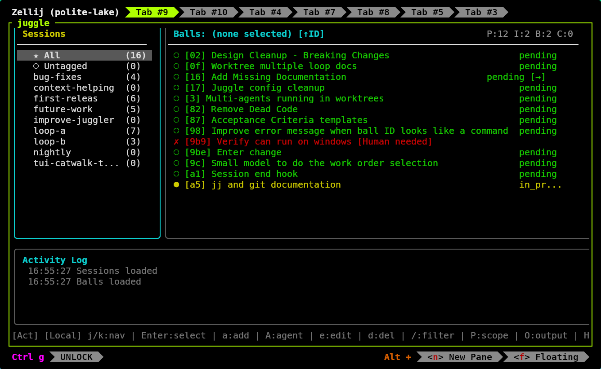
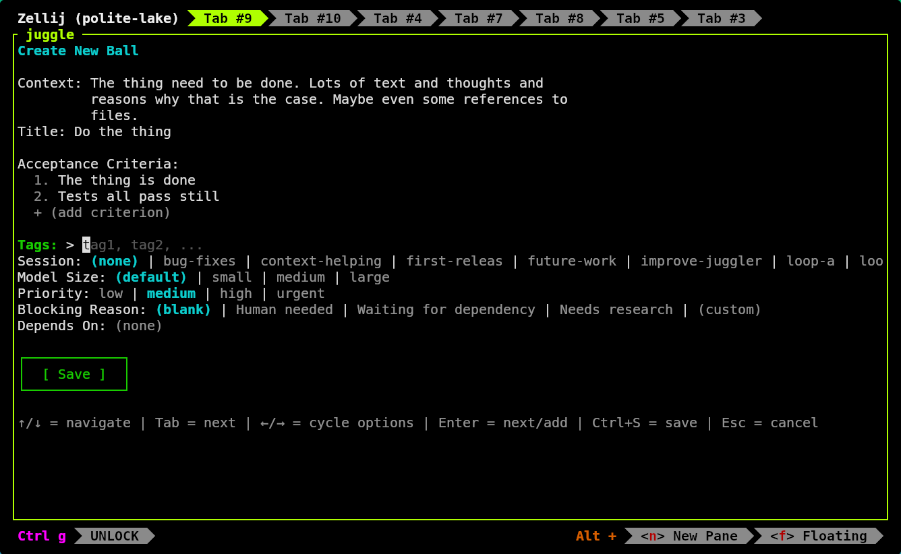
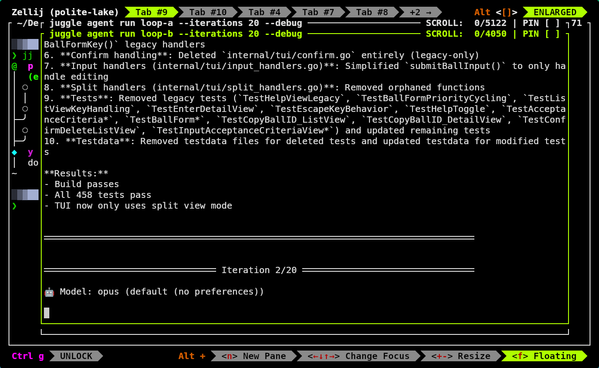
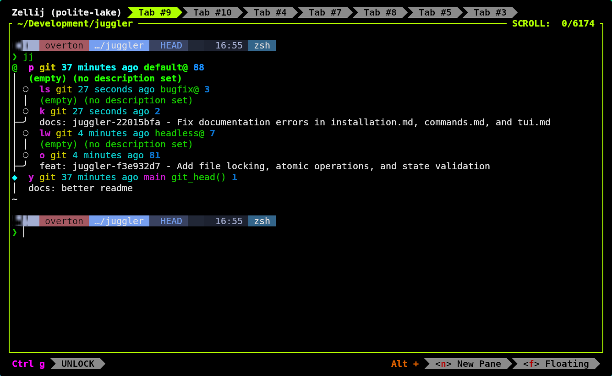

# Juggle

A task runner for AI agent loops. Define tasks with acceptance criteria,
let agents execute autonomously, manage work via TUI while they run.

## Why Juggle?

The [Ralph Loop](https://github.com/snarktank/ralph) is powerful but raw -
a bash script watching a prd.json file. Editing tasks while the loop runs
means fighting the agent for file writes. No priority ordering. No way to
refine tasks without stopping everything.

Juggle adds the missing structure:

- **Edit while running** - TUI file-watches, agent uses CLI; no conflicts
- **Manage the loop** - reorder, prioritize, group tasks into sessions
- **Never run dry** - keep feeding refined tasks so the agent always has work
- **Multiple modes** - headless batch, interactive hand-holding, agent-assisted
  refinement - all in separate terminals, all on the same task list

## Screenshots

**TUI Main View** - Sessions on the left, balls (tasks) on the right, activity log at bottom:



**Ball Creation** - Define context, acceptance criteria, priority, dependencies:



**Parallel Agent Loops** - Multiple agents running simultaneously with live feedback:



**Worktree Management** - Each agent works in its own isolated worktree:



## Quick Start

### Install

```bash
curl -sSL https://raw.githubusercontent.com/ohare93/juggle/main/install.sh | bash
```

### Create a session and add tasks

```bash
cd ~/your-project
juggle sessions create my-feature
juggle tui                        # Add tasks via TUI (recommended)
```

### Run the agent loop

```bash
juggle agent run                  # Interactive session selector
juggle agent run my-feature       # Or specify session directly
```

### Refine already existing tasks interactively

```bash
juggle agent refine
juggle agent refine my-feature
```

### Manage while it runs

Open the TUI:

```bash
juggle                            # Add/edit/reorder tasks live
```

Or just add / edit / view tasks directly in the terminal:

```bash
juggle plan

juggle update 162b4eb0 --tags bug-fixes,loop-a

juggle update cc58e434 --ac "juggle worktree add <path> registers worktree in main repo config" \
       --ac "juggle worktree add creates .juggle/link file in worktree pointing to main repo" \
       --ac "All juggle commands in worktree use main repo's .juggle/ for storage" \
       --ac "Ball WorkingDir reflects actual worktree path (not main repo)" \
       --ac "juggle worktree remove <path> unregisters and removes link file" \
       --ac "juggle worktree list shows registered worktrees" \
       --ac "Integration tests for worktree registration and ball sharing" \
       --ac "devbox run test passes"
```

## Roadmap

- **More agents** - Support beyond Claude Code (Cursor, Aider, etc.)
- **TUI-integrated loop** - Run the agent loop inside TUI with live output
- **Workspace automation** - Automatic git worktree/branch setup per session
- **Endless mode** - Agent stays running, polling for new tasks when queue empties
- **Notifications** - Get notified when tasks complete or need attention

## Built With Itself

<!--
Commit stats generated with:
jj log --no-graph -r 'ancestors(@)' -T 'committer.timestamp() ++ "\n"' | cut -d' ' -f1 | sort | uniq -c | sort -k2

Output on 2026-01-14:
     44 2026-01-10
      6 2026-01-11
     92 2026-01-12
     22 2026-01-13
     38 2026-01-14
(plus 7 earlier commits from Oct/Nov 2025 initial setup)
-->

Juggle was built using juggle - after the first few clunky Ralph Loops with bash scripts and there was something working here.

Here's the commit activity from 5 days of development:

```
Jan 10  ████████████████████████████████████████████░░░░░░░░  44
Jan 11  ██████░░░░░░░░░░░░░░░░░░░░░░░░░░░░░░░░░░░░░░░░░░░░░░   6
Jan 12  ████████████████████████████████████████████████████  92
Jan 13  ██████████████████████░░░░░░░░░░░░░░░░░░░░░░░░░░░░░░  22
Jan 14  ██████████████████████████████████████░░░░░░░░░░░░░░  38
        ──────────────────────────────────────────────────────
        202 commits in 5 days
```

Multiple agents working in parallel on isolated worktrees, each focused on
different tasks, all managed through the same TUI and a multiplex terminal (Zellij).

## Parallel Agents with Worktrees

Each agent can work in its own isolated worktree, allowing multiple agents to run
simultaneously without stepping on each other. All worktrees share the same ball
state from the main repo's `.juggle/` directory.

```bash
# Terminal 1: Run agent in main repo
cd ~/Development/my-project
juggle agent run session-a

# Terminal 2: Run agent in worktree
cd ~/Development/my-project-worktree
juggle agent run session-b
```

**Important:** The TUI is for managing tasks, not running agents. Run `juggle agent run`
from separate terminals while using the TUI to add, edit, and monitor tasks.

See [Worktrees (Parallel Agent Loops)](docs/installation.md#worktrees-parallel-agent-loops)
in the installation guide for setup instructions.

## Documentation

- [Installation Guide](docs/installation.md) - Build from source, worktrees, configuration
- [TUI Guide](docs/tui.md) - Keyboard shortcuts, views, workflows
- [Commands Reference](docs/commands.md) - Full CLI documentation

## License

MIT
